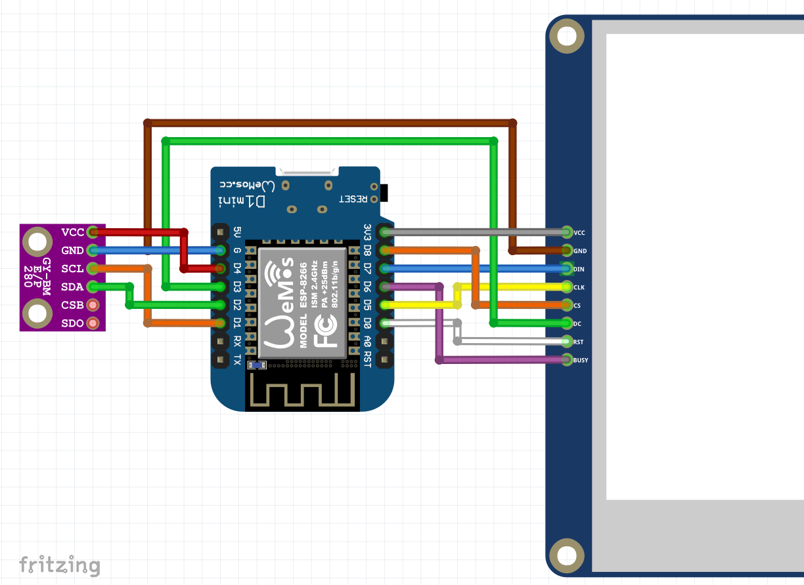

# legendary-dashboard-next
An e-paper dashboard in a photo frame to show environment information.

## Hardware setup

### Parts

- [Wemos D1 mini ESP8266](https://www.ebay.com/itm/D1-Mini-NodeMcu-4M-bytes-Lua-WIFI-Development-Board-ESP8266-by-WeMos-TEUS/312715205793?epid=0&hash=item48cf475ca1:g:ixEAAOSwo7Zbzszs)
- [Waveshare 4.2" 400×300 ePaper Display](https://www.berrybase.de/raspberry-pi-co/raspberry-pi/displays/4.2-400-215-300-epaper-display-modul-mit-spi-interface-dreifarbig-40-gelb-schwarz-wei-223?c=320&px=m)
- [BME280 Breakout Board](https://www.berrybase.de/bauelemente/sensoren-module/feuchtigkeit/bme280-breakout-board-3in1-sensor-f-252-r-temperatur-luftfeuchtigkeit-und-luftdruck)

### Wire Diagram

## References

### Arduino, ESP8266

- [ESP8266 Pinout Reference](https://randomnerdtutorials.com/esp8266-pinout-reference-gpios/)
- [ESP8266 Timer and Ticker Example](https://circuits4you.com/2018/01/02/esp8266-timer-ticker-example/)